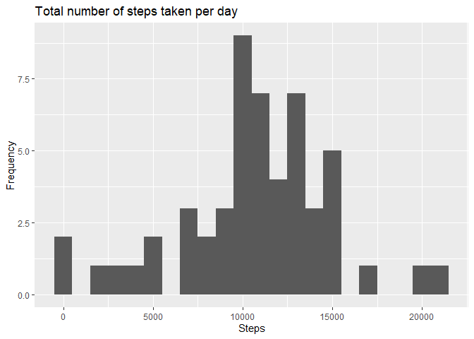

Loading and preprocessing the data
---


What is mean total number of steps taken per day?
---
1) Calculate the total number of steps taken per day


```r
Total_S_D <- DT_activity %>% group_by(date) %>% summarise(steps=sum(steps))
```

2) Make a histogram of the total number of steps taken each day


```r
ggplot(Total_S_D, aes(x = steps))+geom_histogram(binwidth = 1000)+labs(title="Total number of steps taken per day",x="Steps",y="Frequency")
```

```
## Warning: Removed 8 rows containing non-finite values (stat_bin).
```

<!-- -->

3) Calculate and report the mean and median of the total number of steps taken per day


```r
mean_S_D <- mean(Total_S_D$steps, na.rm = TRUE)
median_S_D <- median(Total_S_D$steps, na.rm = TRUE)
```
The mean is equal to 1.0766189\times 10^{4} and the median is equal to 10765

What is the average daily activity pattern?
---
1) Make a time series plot of the 5-minute interval (x-axis) and the average number of steps taken, averaged across all days (y-axis)


```r
Interval <- DT_activity %>% group_by(interval) %>% summarise(steps=mean(steps,na.rm = TRUE))

ggplot(Interval, aes(x = interval , y = steps)) + geom_line() + labs(title = "Avg. Steps", x = "Interval", y = "Avg. Steps vs Intervals")
```

<!-- -->

2) Which 5-minute interval, on average across all the days in the dataset, contains the maximum number of steps?


```r
max<- Interval[Interval$steps == max(Interval$steps),"interval"]
```
The 5-minute interval that contains the maximum number of steps is 835

Imputing missing values
---
Note that there are a number of days/intervals where there are missing values (coded as NA). The presence of missing days may introduce bias into some calculations or summaries of the data

1) Calculate and report the total number of missing values in the dataset (i.e. the total number of rows with NA)


```r
NA_Tot <- nrow(DT_activity[is.na(DT_activity$steps),])
```

The total number of missing values is 2304

2) Devise a strategy for filling in all of the missing values in the dataset. The strategy does not need to be sophisticated. For example, you could use the mean/median for that day, or the mean for that 5-minute interval, etc.


```r
mean(DT_activity$steps, na.rm = T)
```

```
## [1] 37.3826
```

3)Create a new dataset that is equal to the original dataset but with the missing data filled in.


```r
DT_activity_Clean <- DT_activity
DT_activity_Clean$steps[is.na(DT_activity_Clean$steps)] <- mean(DT_activity_Clean$steps, na.rm = T)
```

Make a histogram of the total number of steps taken each day and Calculate and report the mean and median total number of steps taken per day. Do these values differ from the estimates from the first part of the assignment?


```r
DT_activity_Clean_Grouped <- DT_activity_Clean %>% group_by(date) %>% summarise(steps=sum(steps))
ggplot(DT_activity_Clean_Grouped, aes(x = steps))+geom_histogram(binwidth = 1000)+labs(title="Total number of steps taken per day",x="Steps",y="Frequency")
```

<!-- -->

What is the impact of imputing missing data on the estimates of the total daily number of steps?


```r
mean_S_D_Clean <- mean(DT_activity_Clean_Grouped$steps)
median_S_D_Clean <- median(DT_activity_Clean_Grouped$steps)
```

Now the mean (1.0766189\times 10^{4}) is equal to the median (1.0766189\times 10^{4})

Are there differences in activity patterns between weekdays and weekends?
---

Create a new factor variable in the dataset with two levels – “weekday” and “weekend” indicating whether a given date is a weekday or weekend day.


```r
DT_activity_Clean$weekdays <- weekdays(as.Date(DT_activity_Clean$date))

DT_activity_Clean$week[(DT_activity_Clean$weekdays == "sabato" | DT_activity_Clean$weekdays == "domenica")] <- "weekend"
DT_activity_Clean$week[!(DT_activity_Clean$weekdays == "sabato" | DT_activity_Clean$weekdays == "domenica")] <- "weekdays"
```

Make a panel plot containing a time series plot of the 5-minute interval (x-axis) and the average number of steps taken, averaged across all weekday days or weekend days (y-axis). 


```r
Interval_W <- DT_activity_Clean %>% group_by(interval,week) %>% summarise(steps=mean(steps,na.rm = TRUE))

ggplot(Interval_W, aes(x = interval , y = steps)) + geom_line() + facet_grid(.~week)+labs(title = "Avg. Steps", x = "Interval", y = "Avg. Steps vs Intervals")
```

<!-- -->
